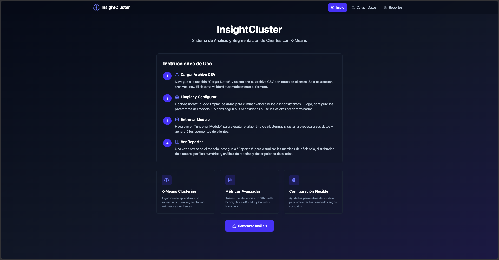
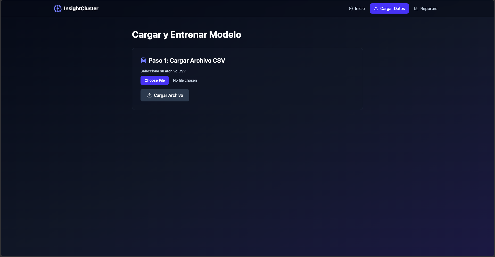
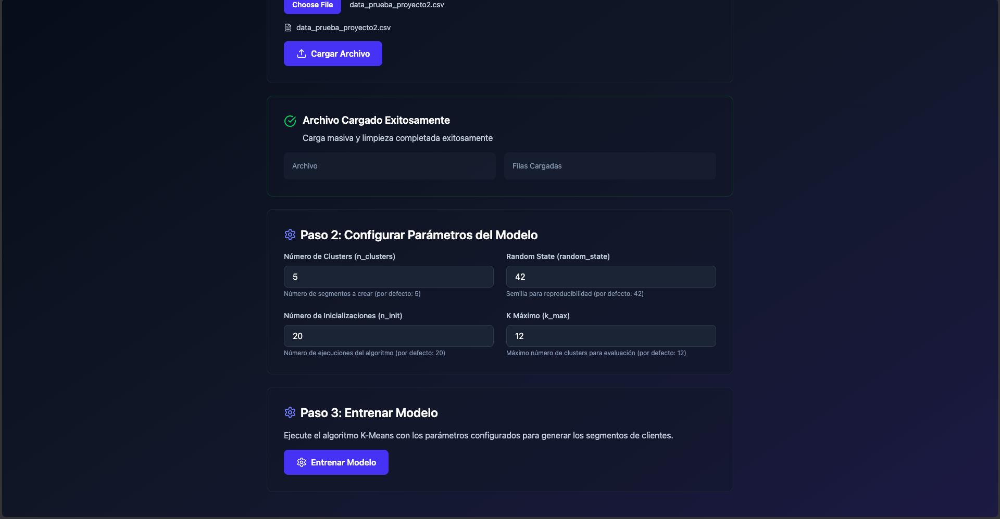
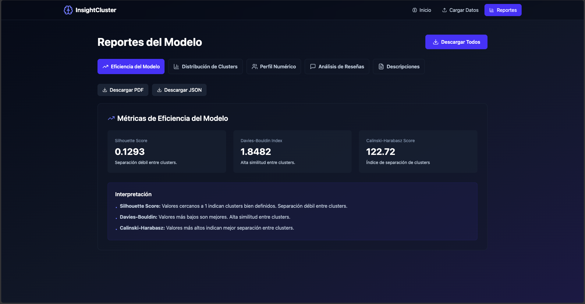

# InsightCluster – Manual de Usuario

## Introducción

**InsightCluster** es una aplicación web orientada al análisis de datos de clientes mediante técnicas de **aprendizaje no supervisado**.  
Su objetivo principal es permitir la **segmentación de clientes y el análisis de reseñas** para descubrir patrones en los datos, facilitando la comprensión del comportamiento de los usuarios y facilitando así la toma de decisiones.

La aplicación está diseñada para ser **intuitiva**, **guiada por pasos** y accesible para usuarios sin conocimientos avanzados en *machine learning*.

---

## Interfaz Principal y Dashboard

Al ingresar a InsightCluster, el usuario accede a un **dashboard explicativo**, desde el cual puede visualizar el flujo general del sistema y acceder a los distintos módulos mediante una barra de navegación superior:

- **Carga de Datos**
- **Entrenamiento**
- **Reportes**

El dashboard presenta información introductoria sobre:
- El propósito del análisis.
- Los pasos necesarios para utilizar el sistema.
- Indicaciones para seguir el flujo correcto de trabajo.

---

## ¿Cómo funciona InsightCluster?

InsightCluster opera mediante un flujo de trabajo estructurado en **tres etapas**:

1. **Carga y preprocesamiento de datos**
2. **Configuración y entrenamiento del modelo**
4. **Visualización y exportación de reportes**

Cada etapa depende de la anterior, y el sistema valida que el proceso se ejecute en el orden correcto.

---

## 1. Carga y Preprocesamiento de Datos

En este módulo el usuario puede **cargar archivos CSV** que contengan información de clientes y reseñas.

### Funcionalidades

- Selección o arrastre de archivos CSV.
- Validación automática de columnas requeridas.
- Limpieza y normalización de los datos.
- Confirmación visual de que los datos han sido procesados correctamente.

### Variables esperadas

El archivo debe incluir variables numéricas y textuales como:

- Frecuencia de compra  
- Monto total y promedio gastado  
- Días desde la última compra  
- Antigüedad del cliente  
- Número de productos distintos  
- Texto de reseñas  

Si el archivo no cumple con el formato esperado, el sistema mostrará un mensaje de error.

---

## 2. Configuración y Entrenamiento del Modelo

Este módulo permite **configurar y ejecutar el entrenamiento del modelo de clustering**.

### Hiperparámetros configurables

- **Cantidad de clusters**: número de segmentos a generar.
- **Máximas iteraciones**: límite del proceso de entrenamiento.
- **Variante del algoritmo**: selección del método de clustering disponible.
- **Semilla aleatoria** (si aplica): para reproducibilidad de resultados.

Una vez definidos los parámetros, el usuario debe presionar **Iniciar entrenamiento**.

### Resultado del entrenamiento

- Asignación de cada cliente a un cluster.
- Almacenamiento de métricas internas de evaluación.
- Preparación de la información para los reportes.

---

## 3. Reportes y Visualización de Resultados

El módulo de reportes es el componente central para la **interpretación de los resultados del clustering**.

### Reportes disponibles

#### Eficiencia del Modelo
- Presenta métricas de rendimiento con interpretaciones claras.
- Permite evaluar la calidad general del modelo entrenado.

#### Distribución de Clusters
- Muestra la cantidad y porcentaje de elementos por cluster.
- Facilita la identificación de segmentos dominantes o minoritarios.

#### Perfil Numérico por Cluster
- Resume las características numéricas promedio de cada segmento.
- Permite comparar patrones de comportamiento entre clusters.

#### Análisis de Reseñas
- Analiza las reseñas asociadas a cada cluster.
- Identifica palabras frecuentes y temas predominantes.

#### Descripción de Segmentos
- Genera descripciones comprensibles de cada cluster.
- Traduce resultados técnicos en información útil para la toma de decisiones.

---

## Exportación de Reportes

InsightCluster permite **exportar los resultados del análisis**, facilitando su uso en informes y presentaciones.

### Funcionalidades

- Descarga de archivos con datos segmentados.
- Exportación de resúmenes de clusters.
- Organización clara de la información exportada.

---

## Flujo de Uso Recomendado

1. Acceder al dashboard y revisar el flujo del sistema.
2. Cargar un archivo CSV válido en el módulo de **Carga de Datos**.
3. Configurar los hiperparámetros en **Entrenamiento**.
4. Ejecutar el entrenamiento del modelo.
5. Analizar los resultados en **Reportes**.
6. Exportar los reportes generados.

---

## Solución de Problemas Comunes

- **No puedo entrenar el modelo**: verifica que los datos hayan sido cargados correctamente.
- **Error en el archivo CSV**: revisa nombres de columnas y tipos de datos.
- **Reportes no disponibles**: el modelo debe entrenarse primero.
- **Clusters poco claros**: ajusta el número de clusters o los parámetros y reentrena.

---

## Conclusión

InsightCluster integra técnicas de aprendizaje no supervisado con una interfaz clara y estructurada, permitiendo que usuarios no técnicos puedan explorar, interpretar y aprovechar información valiosa a partir de datos complejos de clientes y reseñas.
